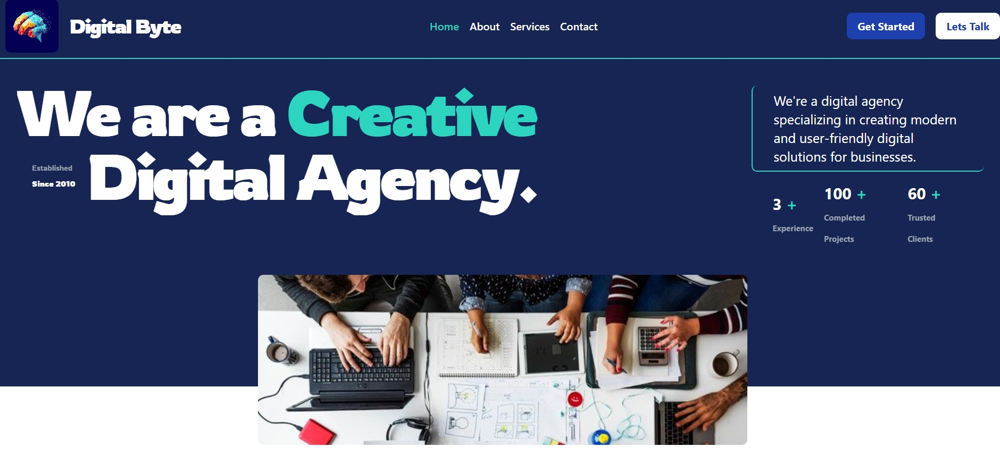
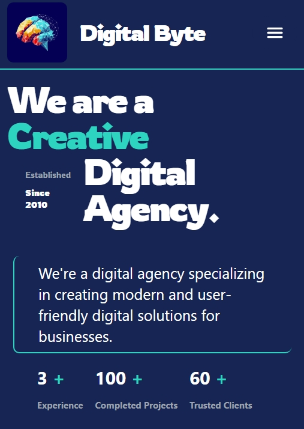
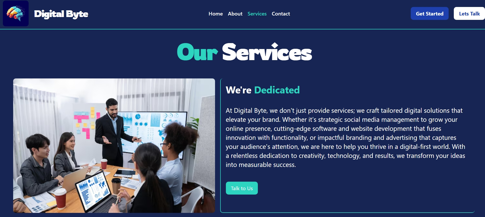
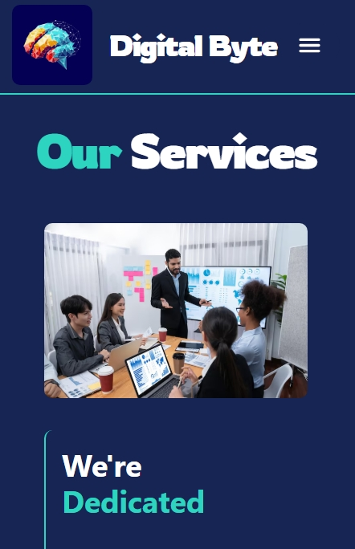

# FlestaPro Agency 🚀

A modern digital agency website specializing in crafting user-friendly digital solutions for businesses. Built with cutting-edge technologies and smooth animations.

## 🌟 Features

- **Modern & Responsive Design**: Mobile-first approach with Tailwind CSS
- **Smooth Animations**: GSAP-powered transitions and scroll effects
- **Comprehensive Services Showcase**: Branding, Web Development, Digital Marketing & more
- **Interactive UI Elements**: Engaging hover states and micro-interactions
- **Contact System**: Integrated with React Hot Toast notifications
- **SEO-friendly Structure**: Semantic HTML and optimized metadata

## 🛠 Technologies Used

### Frontend
- **React** 18.3.1 (with Vite)
- **React Router** 7.0.2 for navigation
- **React Icons** 5.4.0

### Animations
- **GSAP** 3.12.5 for smooth animations

### Styling
- **Tailwind CSS** 3.4.16 with PostCSS
- **Autoprefixer** 10.4.20

### Utilities
- **React Hot Toast** 2.4.1 for notifications
- **ESLint** 9.15.0 for code quality

## 🚀 Getting Started

### Prerequisites
- Node.js ≥16.x
- npm ≥9.x

## 📸 Screenshots

| Description | Preview | Mobile View |
|-------------|---------|-------------|
| **Homepage** |  |  |
| **Services** |  |  |

## 🌐 Live Demo

  
Experience the live version: [digitalbyteagency.vercel.app](https://digitalbyteagency.vercel.app)

## 🎨 Design Philosophy
- Minimalist Aesthetics
- User-First Approach
- Performance Optimization
- Cross-Device Consistency
- Accessible Interactions
- Brand-Aligned Visuals

## 📬 Contact

**Robert Ncube** - Lead Developer & Designer

👨💻 **Maintainer**: [Robert Ncube](https://github.com/Robert-Ncube)  
🐛 **Report Issues**: [GitHub Issues](https://github.com/Robert-Ncube/digitalbyte-agency/issues)

## 🤝 Contributing

Contributions are welcome! Follow this workflow:

1. 🍴 Fork the project
2. 🌿 Create your feature branch:  
   `git checkout -b feature/AmazingFeature`
3. 💾 Commit changes:  
   `git commit -m 'Add some amazing feature'`
4. 🚀 Push to branch:  
   `git push origin feature/AmazingFeature`
5. 🔀 Open a Pull Request

**Before contributing**, please:
- Discuss major changes via Issues first
- Maintain consistent code style
- Update documentation when applicable

## 📜 License

---

✨ Crafted with passion by [Robert Ncube](https://github.com/Robert-Ncube)

